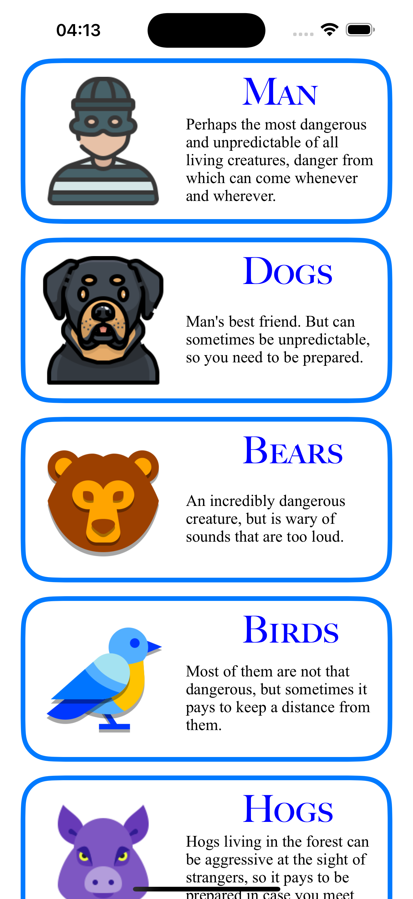
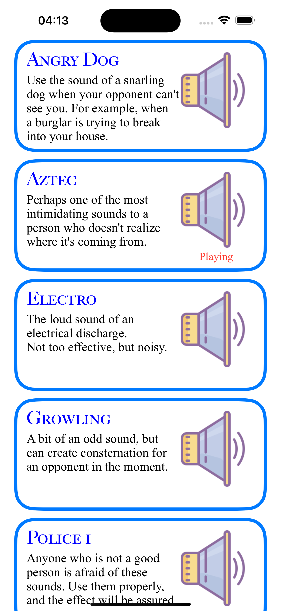

# Scare an animal IOS App

### Use different sounds that can scare away a certain type of predator to protect yourself. (Note: it is recommended to use with a loudspeaker to enhance the effect).

###### Note: All sounds used in this application are found in open sources and are used solely for informational purposes to create this application. There are no guarantees of protection from wild animals.

  
  
   
  
  
   
  
  

## Overview
This application is an educational project and was created as a prototype of a real animal and human repeller that poses a danger to your life and health.

The effect of this idea is to make sounds that can scare away specific types of hazards, which are divided into groups in this application (see screen 2).

## Features
 * Choose the type of danger
 * Turn on the sound that fits your description
 * Turn off and change the sounds if necessary
 * Switch between danger types by swipe to select other sounds

## Technologies
 * UIKit
 * AVFoundation
 * Animation
 * Gesture Recognizers
